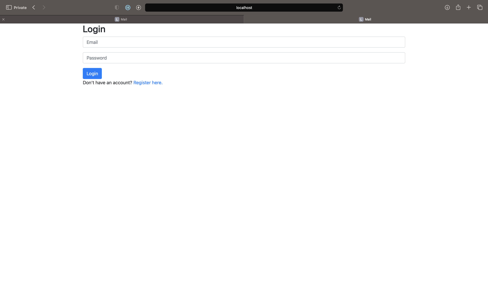
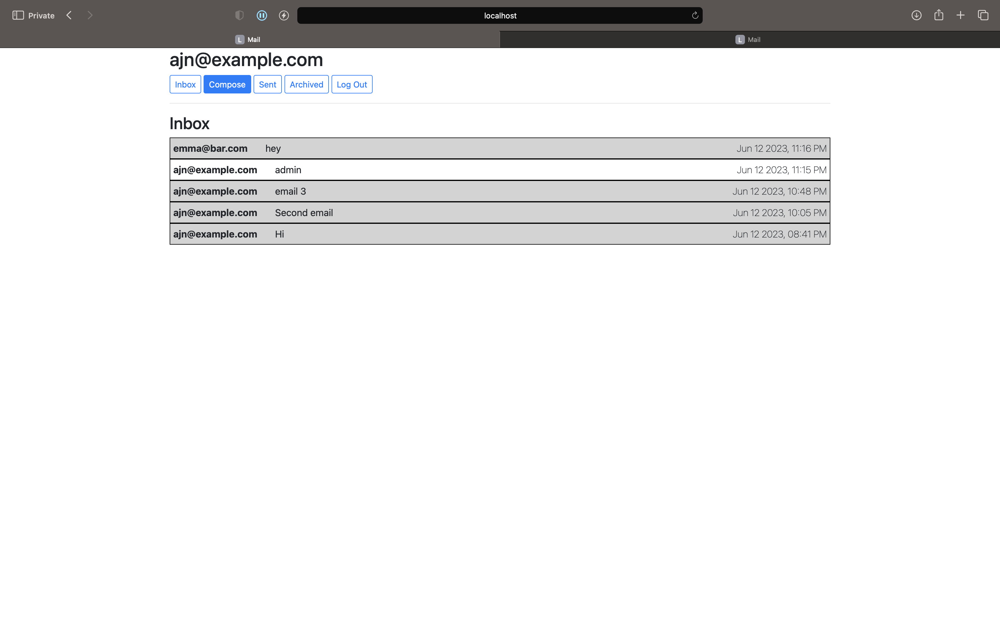
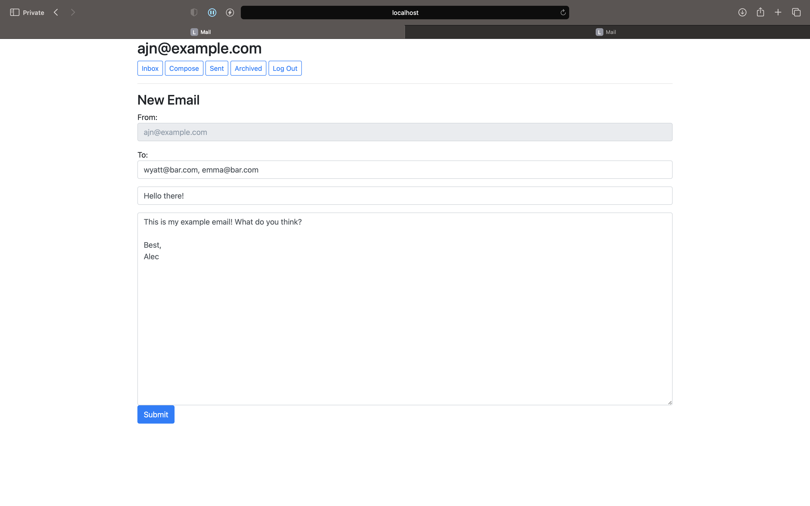
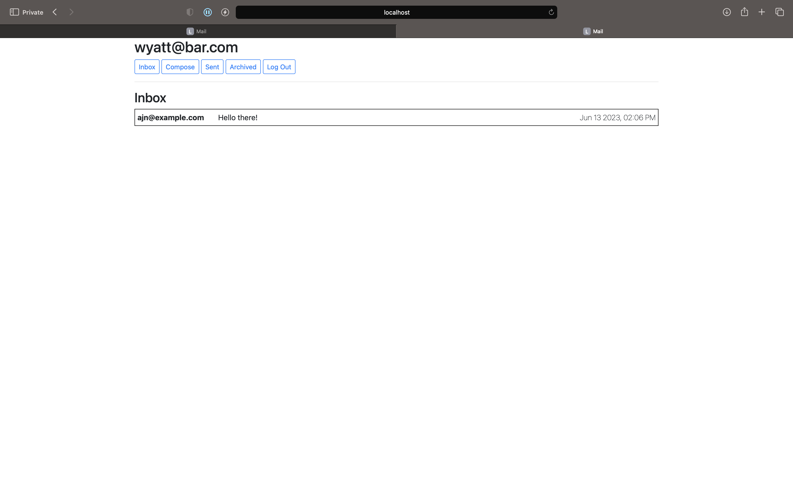
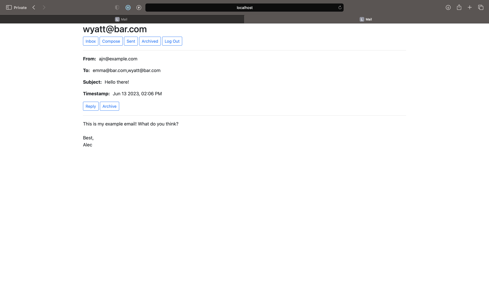

# Mail
An email user interface created using JavaScript, HTML, and CSS (with Bootstrap). The underlying Django and API were sourced from CS50's Web Course, but all other code is original.

## Overview
When a user first accesses the site, they're presented with an opportunity to log in or register.

Once the user logs in, they are presented with their inbox view. The user can choose between viewing their inbox, sent, or archived emails. Emails that have been
read are denoted with a gray background.

To compose an email, the user clicks a button labeled "Compose".

The user can then send the email to other registered users. This email will appear in their inboxes.

Users can click on each email to view its contents.

Clicking "Reply" takes the user to the "New Email" page and pre-fills it with the relevant information.
